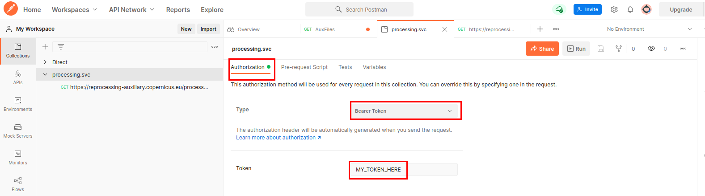
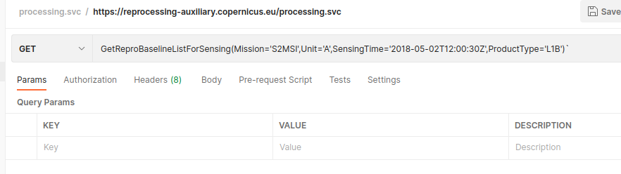

#### Endpoint
The endpoint url for this service is [https://reprocessing-auxiliary.copernicus.eu/processing.svc](https://reprocessing-auxiliary.copernicus.eu/processing.svc)

#### Function
We will use in this sample the function GetReproBaselineListForSensing :

- **GetReproBaselineListForSensing**(Mission, Unit, SensingTime, ProductType)

    Query the list of aux file for these particular parameters.

    Sample : `https://reprocessing-auxiliary.copernicus.eu/processing.svc/GetReproBaselineListForSensing(Mission='S2MSI',Unit='A',SensingTime='2018-05-02T12:00:30Z',ProductType='L1B')`

#### Steps
First, into the authentication tab, select a Bearer Token and fill it with your token :
{:style="border:1px black solid"}

Then, add the function in the GET field :

{:style="border:1px black solid"}

You can now send the query.

