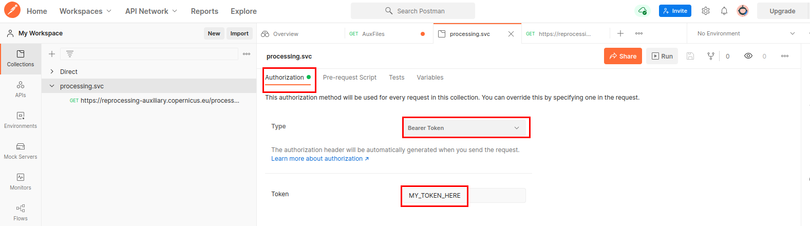
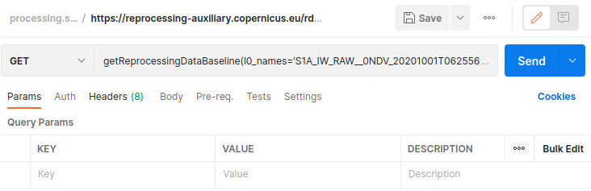

#### Endpoint

The endpoint url for this service is [https://reprocessing-auxiliary.copernicus.eu/rdb.svc](https://reprocessing-auxiliary.copernicus.eu/rdb.svc)

#### Function
We will use in this sample the function getReprocessingDataBaseline :

- **getReprocessingDataBaseline**(l0_names, mission, unit, product_type)

    Query only one level 0 product name.
    
    Sample : `https://reprocessing-auxiliary.copernicus.eu/rdb.svc/getReprocessingDataBaseline(l0_names='S1A_IW_RAW__0NDV_20201001T062556_20201001T063833_034599_040733_8B28.SAFE.zip',mission='S1SAR',unit='A',product_type='L1SLC')`

#### Steps
First, into the authentication tab, select a Bearer Token and fill it with your token :
{:style="border:1px black solid"}

Then, add the function in the GET field :

{:style="border:1px black solid"}

You can now send the query.
